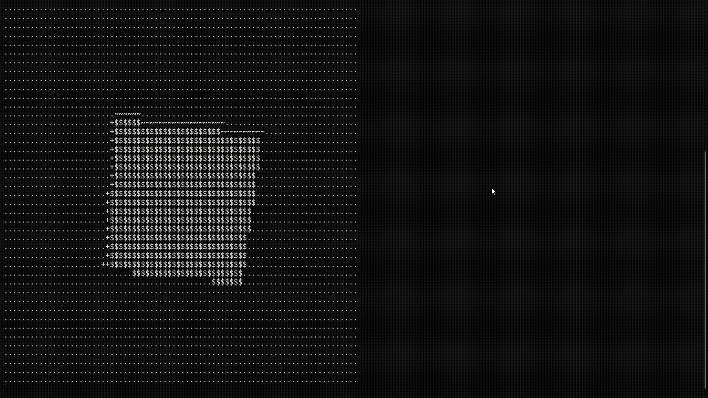

# About

Having found Andy Sloane's [spinning torus](https://www.a1k0n.net/2006/09/15/obfuscated-c-donut.html) code some time
ago, I have decided to make my own toy version, but with a cube. Since I really want to learn C,
I have decided to use it as my language of choice for this *small* project.



# How to run

On Linux the *main.c* file can be compiled and executed with the following commands:

```console
gcc main.c -o main -lm & ./main
```